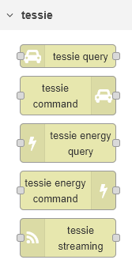

# Node-Red-Contrib-Tessie-API

These nodes are designed to interact with the Tessie API (https://tessie.com) to retrieve information on Tesla vehicles that are connected to Tessie.  

Config nodes:

- For all of the nodes, you must configure a server.  The default base URL (https://api.tessie.com) should work.  Enter a valid API token and optionally a name and save the server config
- For the tessie-query and tessie-command nodes, you must configure one or more vehicles.  Enter any name and the vehicle VIN and save the vehicle config
- For the tessie-energy-query* and tessie-energy-command nodes, you must configure an energy site.  Enter any name and the site ID
  - *You can run the 'products' query with no site configured.  Look in the msg.payload.response for the energy_site_id and add it to a site config

## Tessie Query Node
To use the tessie-query node:

- Select a server, vehicle and query type
- Any additional fields that are required or available will be displayed
- For the 'From' and 'To' fields, enter a Unix timestamp in seconds.  You can use the date and time fields below the 'From' or 'To' to automatically calculate the Unix timestamp.  When only a date is entered, it sets the timestamp to midnight on that date.  When only a time is entered, it sets that time on the current date.  Calculations are based on local time.

## Tessie Command Node
To use the tessie-command node:
- Select a server, vehicle, and command type
- Any additional fields that are required or available will be displayed

## Tessie Energy Query Node
To use the tessie-energy-query node:
- Select a server, query type, and site (except for 'Products' query)
- Any additional fields that are required or available will be displayed
- All time entries are sent to the API in UTC
  - You can use the date/time pickers to create the correct RFC3339 timestamp by selecting a date and a time
  - You can select 'Local' or 'UTC' as the mode for the time pickers.  When set to 'Local', the date and time you pick will be converted from your local TZ to UTC.  When set to 'UTC', the date and time you pick will not be modified.  You can also directly enter an RFC3339 time string without using the date and time pickers.

## Tessie Energy Command Node
To use the tessie-energy-command node:
 - Select a server, site, and command
 - Any additional fields that are required or available will be displayed

## Tessie Streaming Node
The `tessie-streaming` node connects to the Tessie WebSocket API for real-time streaming data and periodically polls the REST API for full vehicle state data.  It is intended to format the data for output to an MQTT-out node to share the data with subscribers via an MQTT server.

### Features

- Real-time streaming via WebSocket (e.g., speed, battery level, GPS, climate)
- Periodic full-state refresh via REST API (configurable interval)
- Optional grouping of the periodic data into a single message rather than individual topics
- Unit conversion for distance/temperature/pressure fields (metric or imperial)
- Whitelist/blacklist filtering of data keys
- Debug output for raw data inspection
- Auto-start and manual control via input messages

### Inputs

You can use the node input to stop and start the process, or to set the top-level MQTT topic.
- `msg.payload = "start"` — Starts streaming and periodic refresh
- `msg.payload = "stop"` — Stops all activity

If you do not check the 'Auto-start on deploy' option, the node will not do anything until it receives a start message.

### Outputs

- **Output 1**: Parsed vehicle data (individual or grouped messages)
- **Output 2**: Raw debug data (if debug mode is enabled)

### Configuration

To use the streaming node you must have at least one vehicle and two servers configured.  Currently the server Base URLs should be set to https://api.tessie.com and wss://streaming.tessie.com.
- **Vehicle**: Create or select a vehicle config node (includes VIN).  The name configured for this vehicle will be used as the second element of the MQTT topic, after Topic Root.
- **Server**: Create or select the Tessie API server config (base URL and token)
- **Stream Server**: Create or select the Tessie websocket streaming server config (WebSocket URL and token)
- **Topic Root**: Base topic prefix for output messages
- **Refresh Interval**: Polling interval in seconds for REST API.  Set to 0 to disable periodic refresh.
- **Units**: Metric or Imperial
- **Whitelist/Blacklist**: Filter keys to include/exclude from the output
- **Group Output**: Send periodic data as one grouped message
- **Debug**: Enable verbose logging and raw output
- **Auto Start**: Begin streaming on deploy

### Status Indicators

- 🟢 **Green**: Connected and healthy
- 🟡 **Yellow**: Starting up
- 🔴 **Red**: Error in streaming or refresh
- ⚪ **Gray**: Stopped or idle

## 🔍 Whitelist and Blacklist Filtering Logic

This node supports optional `whitelist` and `blacklist` filters to control which telemetry keys are published. These filters use **prefix matching**, and follow a clear precedence rule:

### ✅ Precedence Rule
> **Specific whitelisted keys override broader blacklists.**

This means if a key matches both a whitelist and a blacklist, the whitelist takes priority and the key will be included.

---

### 🧪 Behavior Examples

| Scenario | Result |
|----------|--------|
| **Only a whitelist** (e.g. `drive_state/speed`) | Only keys that match or start with `drive_state/speed` will be published. All others are excluded, even if not blacklisted. |
| **Only a blacklist** (e.g. `climate_state`) | All keys are published except those that match or start with `climate_state`. |
| **Whitelist: `charge_state/battery_level`**, Blacklist: `charge_state` | Only `charge_state/battery_level` is published. All other `charge_state` keys are excluded. Keys from other categories (e.g. `drive_state`, `climate_state`) are also excluded because they are not whitelisted. To blacklist ONLY all other charge_state topics, you will need to whitelist the top level of the other topics (e.g. `climate_state`, `media_info`, `drive_state`)|

---

### 🛠 Notes
- Filters use **prefix matching**, so `charge_state` matches all keys like `charge_state/battery_level`, `charge_state/charging_state`, etc.
- Whitelist entries can be **specific keys** or **prefixes**.
- If the whitelist is **empty**, all keys are considered whitelisted by default.
- If a key matches **both** a whitelist and a blacklist, the whitelist **wins**.

## Screenshots

